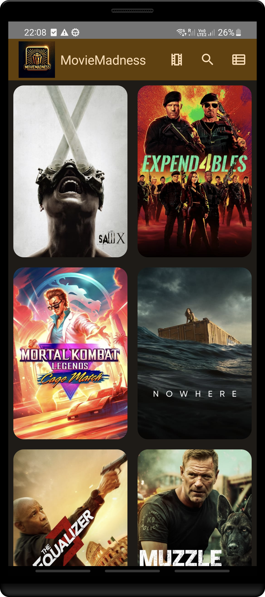
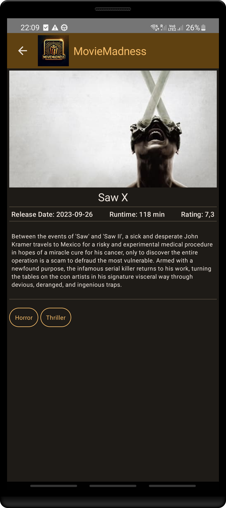
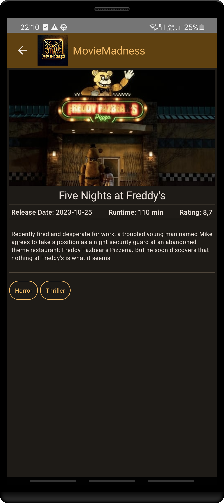

# MovieMadness

MovieMadness is an Android app that allows users to explore a vast collection of movies fetched from The Movie Database (TMDB). This repository contains the source code for the MovieMadness Android app. The app is built using Kotlin and leverages modern Android development tools and architecture components, including Jetpack Compose, Google Material 3, Clean Architecture, MVI (Model-View-Intent), and Hilt for Dependency Injection.

## Features

- Browse a rich catalog of movies from TMDB.
- View detailed movie information, including poster image, overview, release date, and more.

## ToDo
- ToDo: Search for specific movies based on titles or keywords.
- ToDo: Filter by genre
- Show TV 

## Screenshots

    

        
         
        *Screenshot 1: Basic List Screen*
    

    

        
         
        *Screenshot 2: Modern List Screen*
    

    

         
        *Screenshot 3: Movie Details E.g 1*
    

    

        
         
        *Screenshot 4: Movie Detail E.g 2*
    

## License

This project is licensed under the MIT License - see the [LICENSE](LICENSE) file for details.

## Acknowledgments

- The Movie Database (TMDB) for providing the movie data and API.

## Contact

If you have any questions or suggestions, feel free to contact me at [wesleypanaino@gmail.com](mailto:wesleypanaino@gmail.com).

Thank you for using MovieMadness! Enjoy exploring the world of movies right at your fingertips. 🍿🎬